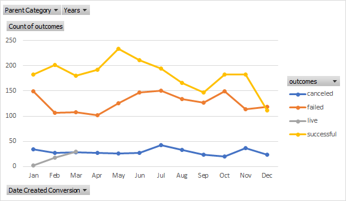
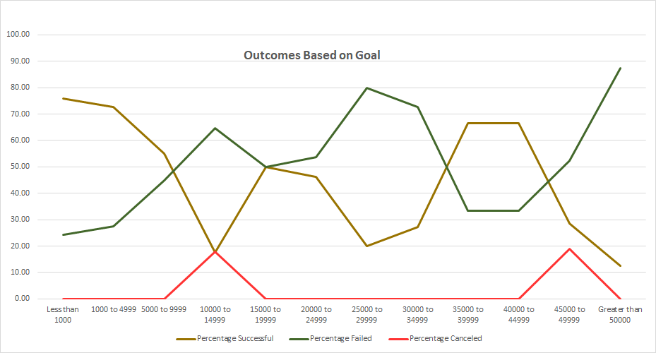

# An Analysis of Kickstarter Campaigns
Analysis of Kickstarter data to uncover trends. The purpose of this analysis is to visualize Kickstarter campaign outcomes based on their launch dates and funding goals. The dataset includes over 3,800 Kickstarter campaigns from nine different countries. 

## Analysis and Challenges
This analysis focuses on how the launch dates and original funding goals of a Kickstarter campaign, especially in the theater space, affect the outcomes
of these campaigns. A challenge in working with this dataset is that for many of the parent categories there are few datapoints for campaigns with initial goals that were very high. This fact must be taken into account when looking at the existing data. In the theater category for example, 95% of the campaigns had an initial goal of less than $25,000, so making a decision based upon initial goal for the campaign can be difficult as the lack of existing datapoints for campaigns over $25,000 make it unreliable. 

*Analysis of Outcomes Based on Launch Date

To look at outcomes of Kickstarters based on their launch date, a pivot table was used to filter the dataset into only Kickstarters launched by theaters, and further,
the results were broken down monthly, showing a total number of successes, failures, and cancellations for each month for the entire life of the dataset. 

*Analysis of Outcomes Based on Goals

To perform the analysis of outcomes based on goals, I created a table breaking down the initial goals of the campaigns into subcategories, and showing how many successes, failures and cancellations there were for each subcategory of monetary goal. Next percentage calculations were taken to better see how these campaigns performed relative to their initial goal. 

### Results
When looking at outcomes of Kickstarters based on Launch Date, crowdfunding for theaters is more common and more successful in the late spring and summer months. May through July have been the most succesful months for
in terms of number of succesful Kickstarters, and success rate of Kickstarters. May is also the most succesful month for crowdfunding across all categories, not just for theaters. Additionally, as the year progresses there is a drop in the success rate and number of Kickstarters launched, which is also consistent with crowdfunding data that includes all categories. While keeping the limitations of the dataset in mind, according to the data a good time to start the Kickstarter would besometime around late spring to early summer with May being ideal, and to definitely not launch the Kickstarter during the winter.  
 
 When looking at crowdfunding results based on goals, we see fundraisers with goals under $5,000 were fairly succesful. However, above $5,000 there is a great 
deal of variability because there are far fewer data points. Very few of the Kickstarters launched by theaters for plays had high goals, in fact over 95%
 of the Kickstarters launched for plays had goals of less than $25,000. This makes it difficult to base any decisions on looking at the outcome vs the goal of the 
fundraiser, as a single outlier or non-normal circumstance with a single fundraiser could alter one's results and conclusions in a major way. Based on this dataset,
to have the highest chance of success while still attaining her goals Louise should set the Kickstarter goal at $5,000. Additionally, due to the limitations of this
dataset, and the lack of datapoints for Kickstarters of this kind (Theater) with goals over $25,000, Louise should avoid the uncertainty and risk of performing a Kickstarter
with extremely high goals, as more data needs to be analyzed to find a more accurate measure of success for those fundraisers (preleminary measures do not look good, either).

*Limitations of the dataset and ways to improve

This dataset is limited in several ways. First, the geographic scope of this dataset is very general, filtering through Kickstarter
campaigns by country in which they took place. While this is helpful information, there is no way to compare the results of Kickstarters within a country. For example, this dataset cannot compare Kickstarter campaigns between two regions in a country, between cities within those regions, or even between neighborhoods within those cities. This would be very helpful information as cultures, preferred activities, and economic environment often differ in different parts of a country. A second significant limitation is the lack of economic data that is tied to this dataset. This dataset looks at the outcomes of crowdfunding, but takes no look at the general economic environment of these countries when the fundraiser is taking place. If a country were in a recession, it is more than  likely that both their success rates for Kickstarters, as well as their overall numbers of Kickstarters launched, would decrease. This would definitely be something to take into account in one's analysis, but is not possible with the current state of the dataset. There are many other limitations to this dataset as well, generality of georgraphic scope and a lack of economic data tied to these Kickstarter
campaigns are two ways in which this dataset could be improved upon.   

